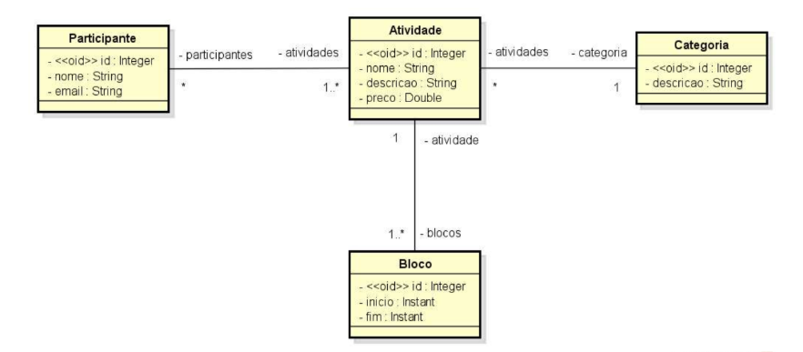
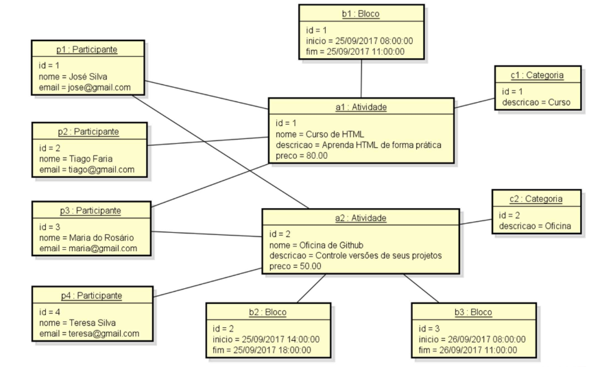

# Sistema Evento – Modelo de Domínio com Spring Boot e JPA

Projeto desenvolvido em **Java com Spring Boot**, com foco na modelagem de domínio, mapeamento objeto-relacional (ORM) e persistência de dados utilizando **JPA/Hibernate** e **banco de dados H2**.

O sistema simula o gerenciamento de atividades de um **evento acadêmico**, permitindo o cadastro de participantes, atividades, categorias e blocos de horários, conforme um modelo conceitual previamente definido.

---

## 🎯 Objetivo do Projeto

Este projeto foi desenvolvido como parte de um desafio técnico-acadêmico com o objetivo de demonstrar:

- Modelagem correta de domínio
- Uso prático de **ORM com JPA**
- Implementação de relacionamentos complexos entre entidades
- Criação automática do schema do banco de dados
- Seeding de dados conforme especificação
- Organização de um projeto Spring Boot seguindo boas práticas

---

## 🧩 Contexto do Sistema

O sistema **EVENTO** é responsável por gerenciar as informações de um evento acadêmico, onde existem diferentes tipos de atividades, como cursos, oficinas e palestras.

Cada atividade possui:
- Nome
- Descrição
- Preço
- Categoria
- Um ou mais blocos de horário (com data, início e fim)

Os participantes podem se inscrever em várias atividades, e cada atividade pode conter vários participantes.

---

## 🗂️ Modelo Conceitual (Diagrama de Classes)

Abaixo está o **diagrama de classes** que representa o modelo conceitual do sistema e orientou toda a implementação do projeto:

Este diagrama define as entidades principais, seus atributos e os relacionamentos, incluindo cardinalidades e associações.

---

## 🧪 Seeding de Dados (Diagrama de Objetos)

Para validação do modelo, o projeto realiza o **seeding automático do banco de dados**, conforme o diagrama de objetos abaixo:

Os dados inseridos representam um cenário realista de participantes inscritos em atividades, com categorias e blocos de horários distintos.

---

## 🛠️ Tecnologias Utilizadas

- **Java**
- **Spring Boot**
- **Spring Data JPA**
- **Hibernate**
- **Banco de Dados H2**
- **Maven**
- **H2 Console**
